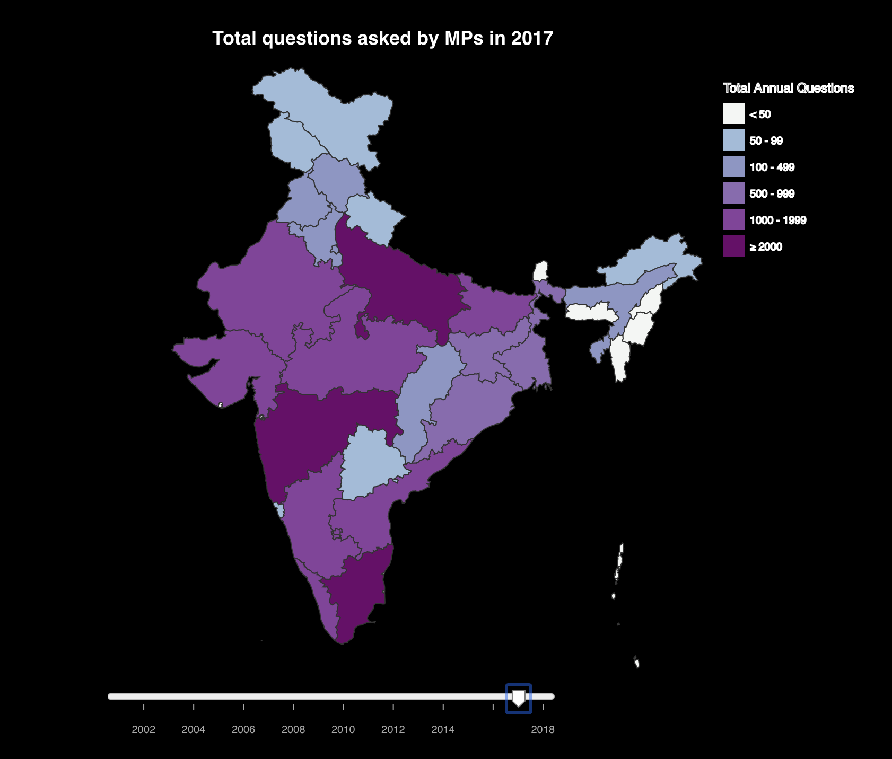

# Exploring the Lok Sabha's Question Hour

Raghav Mehrotra

## Description

Each day of Parliamentary proceedings in India begins with the "Question Hour", when MPs can ask the government questions about any issues of public interest. The nature of questions can vary and include asking the government for data on salient topics (health, migration, literacy) and demanding explanations for policies (e.g. why the State allocated resources in a particular way). The government is required to reply, although the contents of the response can vary widely. In general, Question Hour was designed for Parliament to hold the government accountable.

This tool is designed for citizens to explore the Question Hour data in two ways. First, they can search for topics of interest by keyword (e.g. agriculture, subsidy, etc) to see what is being discussed in the Question Hour and how this has varied over time. Second, they can view how MPs a particular state have participated in the Question Hour over time. The choropleth map counts this by year.

There is a vast amount of publicly available data yet the documents used to share this can be inaccessible, due to paywalled sites, data being made available only in PDFs, different slices of data present on different websites, rate limits, etc. It is my hope that tools like this reduce those barriers and present data in an engaging way. 

## Data Sources

I am grateful to the team at the Trivedi Center for Political Data, Ashoka University, and DataMeet (a community of open data enthusiasts) for making clean data available in an accessible format.

["TPCD-IPD: TCPD Indian Parliament Dataset (Question Hour) 1.0.](https://tcpd.ashoka.edu.in/question-hour) Bhogale, Saloni. Trivedi Centre for Political Data, Ashoka University, 2019.

[Constituency level map of India](https://projects.datameet.org/maps/parliamentary-constituencies/) DataMeet.

[Map of India with pre-2014/2019 boundaries](https://groups.google.com/g/datameet/c/dZ96g7ngWAg) DataMeet Google Group.

## Instructions
1. Download or clone this repository.
2. Navigate to the "docs" directory and run the command "uv run python -m http.server" to start up a localhost.
3. (optional) If you want to analyze the raw data, download it from [here](https://tcpd.ashoka.edu.in/question-hour). Move the raw data into a /data folder in the root directory. Run the cleaning and slice scripts in /src.