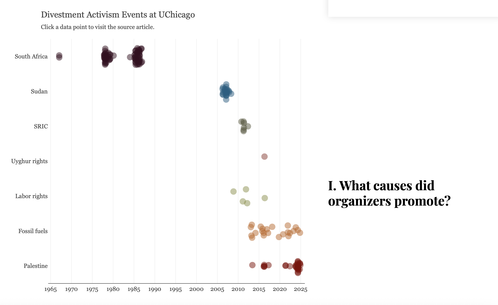
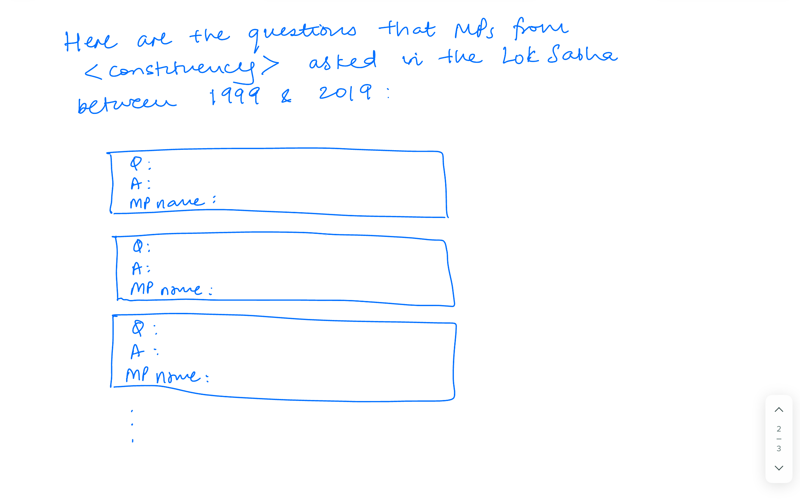

# Raghav Mehrotra

## Description

Each day of Parliamentary proceedings in India begins with the "Question Hour", when MPs can ask the government questions about any issues of public interest. The nature of questions can vary and include asking the government for data on salient topics (crime, migration, literacy) and demanding explanations for policies (why the government created a new institution). The government is required to reply, although the contents of the response can vary widely. In general, Question Hour was designed for Parliament to hold the government accountable.

Using unit (question) level data from 1999-2019, I hope to ask 4 broad questions:

1. Who has made effective use of the Question Hour? Are there particular members, parties, genders, and constituency types represented among those asking questions?

2. Which states/constituencies do most question-askers come from? Has this changed over time?

3. What topics are most addressed? Which ministries are questions directed to?

4. (aspirational) How have the Government's responses changed over time? Do MPs get the replies they want? What is the rate at which the Government denies responding to questions? When do they dodge questions or provide non-answers? 

## Technical Plan re: Option A/B/C/D

A combination of options C and D.

I have always loved reading scrolling news articles that dynamically generate content. Some memorable ones have including a piece on the differential impacts of [air quality](https://www.nytimes.com/interactive/2020/12/17/world/asia/india-pollution-inequality.html) on children in New Delhi, a history of [divestment movements](https://chicagomaroon.github.io/data-visualizations/2025/divestment-history/) at UChicago, and this analysis of [soldiers](https://www.nytimes.com/interactive/2022/12/16/world/europe/russia-putin-war-failures-ukraine.html) on the front lines of the Russia-Ukraine War. I also enjoyed the geospatial pans and zooms while reading the suggested example about [highrises](https://especiales.eldiario.es/spain-lives-in-flats/) in Spain.

I want to tell a medium-long form story with the The Question Hour data. The divestment piece offers a good template for how to use a single timeline and plot multiple slices of the data as the reader scrolls -- here, it could be, for example, how the sex and party affilitation of question-askers has evolved over time. This could be complemented on the side with context -- what did parliament look like? Why were there such few questions during a period? Why did one Ministry receive so many questions during a given month-year? This data would benefit from written analysis, and I am willing to put in that extra work so the visuals have context. I hope to use D3 for the visuals. I recognize that this becomes a mainly temporal analysis, but that could be a good start and might evolve as I explore the actual data.

I want to append an interactive map at the end of this narrative. This can be helpful for citizens to see how many and what kind of questions their representatives (at the constituency/state level) have been asking over the last two decades. I have never used MapLibreGL though, so this could be a challenge.

Question 4 is the most aspirational. I put it in because I realize that using only the categorical variables above (questions 1-3) doesn't incorporate the richness of the text in the dataset, but having never done NLP, I'm uncertain where to start. I will only attempt this once I finish the two steps above, but I am leaving this here in case I continue to build on the project after the class. The goal is to allow the user to enter a free form question (e.g. "How has the government responded to questions about labor rights?") and receive a list of relevant questions and answers that they can view together. I have been exploring OpenAI's API lately and investigating workarounds to paying for the service. Else, can spaCy work for simpler things? Maybe I can just use keywords?

## Mockup

Scrollytelling from the Divestment piece

Rendering the clickable constituency level map

Display the questions for the selected constituency

## Data Sources

### Data Source: Question Hour: Indian Parliament Dataset (Trivedi Centre for Political Data, Ashoka University)

URL: [Question Hour: Indian Parliament Dataset](https://tcpd.ashoka.edu.in/question-hour/)

Size: 298221 rows, 15 columns

The dataset contains all the questions asked during Question Hour from 1999-2019. Fields include the text of the question and  answer, the name, sex party, constituency and constituency type (GEN, SC, ST) of the MP(s) asking the question, and the ministry the question was directed to. There is also a "subject" field that summarizes the question in a few words.

## Questions

1. Does each of the three components (1. scrollytelling 2. map 3. open ended text interactive) qualify as its own project as per the guidelines? Especially 1 and 3 (since 2 falls into C)
2. Is D3 enough to do part 1? 
3. How does one incorporate changing spatial units over time in a single, interactive map? New states, shifting constituency boundaries? Do I just need to limit my analysis to particular years? Render different maps based on the years?
4. How can I best use the actual text content? My only inteaction with NLP has been through CoreNLP in Java (but this was 10+ years ago). I remember you mentioning in a meeting that LLM integrations are a good way to parse text, but what are some Python libraries that would let me do POS tagging, entity recognition? spaCy, huggingface? The text is really what makes the dataset interesting and I would love to use it.